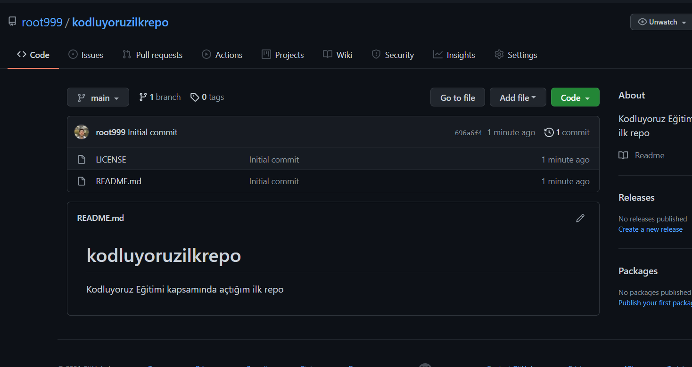

# kodluyoruzilkrepo

Bu repo [Kodluyoruz](https://www.kodluyoruz.org) ve Hepsiburada işbirliğinde Android Bootcampi öncesinde oluşturduğum ilk repo. İçerisinde bir adet README dosyası ve index.html dosyası bulunmakta.



## Installation

Öncelikle projeyi clonelayın. (Buraya sizin reponuzdan aldığınız link gelecek)

```bash
git clone https://github.com/root999/kodluyoruzilkrepo
```

## Usage

Projeyi cloneladıktan sonra Visual Studio Code programında açınız.

Linux için:
```linux
cd kodluyoruzilkrepo
code .
```

## Contributing
Pull requestler kabul edilir. Büyük değişiklikler için, lütfen önce neyi değiştirmek istediğinizi tartışmak için bir konu açınız.


## License
[MIT](https://choosealicense.com/licenses/mit/)
